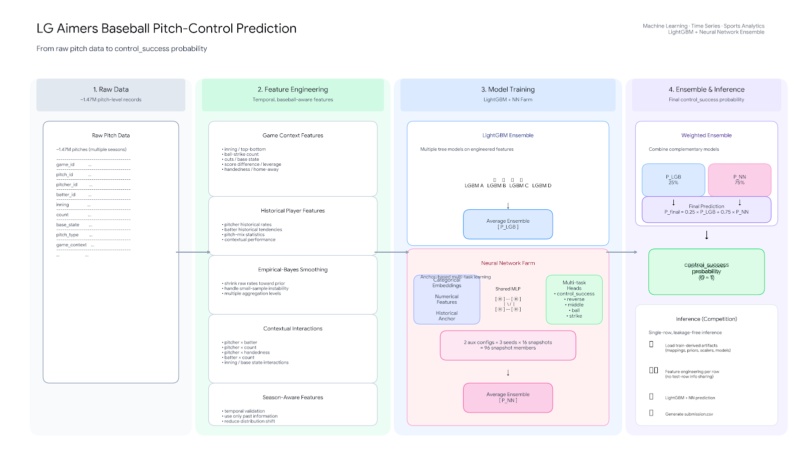
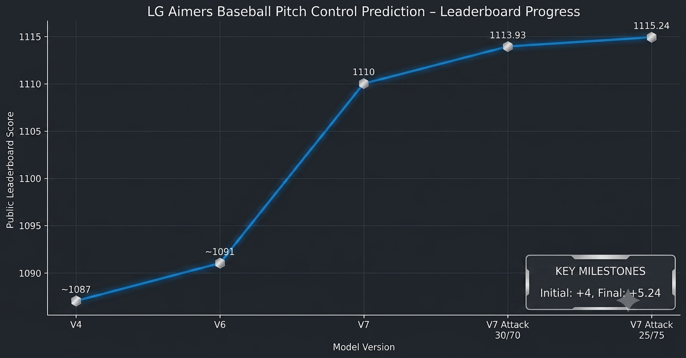

# ⚾ LG Aimers 9th — Baseball Pitch Control Prediction

Pitch-level `control_success` probability prediction using  
temporal feature engineering, LightGBM, and a multi-task neural-network ensemble.

**Best Public LB: 1115.241988**

---

## 🏗️ Pipeline Overview



---

## 📌 Project Overview

This project predicts the probability that a baseball pitch results in
`control_success`.

The dataset contains approximately **1.47 million pitch-level observations**
across multiple seasons.

The main modeling challenges were:

- temporal distribution shift between seasons
- unstable historical player statistics for small samples
- high-dimensional pitcher / batter / count interactions
- probability calibration
- combining complementary model families
- efficient and reliable inference

The final best-performing model combined:

- temporal, leakage-safe feature engineering
- historical pitcher / batter statistics
- Empirical-Bayes smoothing
- contextual interaction features
- LightGBM ensembles
- anchor-based multi-task neural networks
- multi-seed and snapshot averaging
- validation-driven weighted ensembling

---

## 🎯 Task

For every pitch, predict:

```text
P(control_success)
```

where the output is a probability between 0 and 1.

The goal was not simply to classify whether control succeeded, but to produce
stable probability estimates that generalize to future-season data.

---

## ⏱️ Validation Strategy

Baseball data is inherently temporal.

Player ability, league environment, pitch usage, and game context can all
change over time.

Because of this, random train / validation splits were avoided for the main
experiments.

Instead, validation followed a chronological structure:

```text
Past seasons
     │
     ▼
Training
     │
     ▼
Future season
     │
     ▼
Validation
```

Historical features for season `S` were constructed using only information
available before that season.

Conceptually:

\[
\text{features}_t
=
f(x_t,\mathcal{H}_{<t})
\]

where:

- \(x_t\) = current pitch context
- \(\mathcal{H}_{<t}\) = historical information available before prediction

This reduced temporal leakage and made validation more representative of the
actual competition setting.

---

## 🧩 Feature Engineering

The feature pipeline combines immediate game context with historical player
information.

### Game Context

Examples include:

- inning
- top / bottom
- ball-strike count
- outs
- base state
- score difference
- leverage / pressure context
- pitcher and batter handedness
- home / away context

### Historical Player Features

Historical statistics were constructed for both pitchers and batters.

Examples:

```text
Pitcher
├── historical control success
├── reverse / middle miss rates
├── ball / strike rates
├── pitch-mix tendencies
└── contextual performance

Batter
├── historical success environment
├── middle tendencies
└── contextual matchup history
```

### Contextual Interactions

The model also uses interaction-level information such as:

```text
pitcher × batter
pitcher × count
pitcher × batter handedness
pitcher × inning
pitcher × base state
batter × count
batter × pitcher handedness
```

These features allow the model to represent a matchup rather than treating
pitcher and batter characteristics independently.

---

## 📊 Empirical-Bayes Smoothing

Raw historical rates can be unreliable when sample sizes are small.

For example:

```text
Pitcher A
8 successes / 10 pitches

Pitcher B
800 successes / 1000 pitches
```

Both may have the same observed success rate, but their reliability is very
different.

To stabilize historical estimates, rates were shrunk toward a prior:

\[
\hat{p}
=
\frac{s + kp_0}
     {n+k}
\]

where:

- \(s\): observed successes
- \(n\): number of historical observations
- \(p_0\): prior probability
- \(k\): prior strength

This reduces small-sample instability while allowing well-observed players to
retain their individual characteristics.

---

## 🌲 LightGBM Ensemble

The first model family is a LightGBM ensemble trained on engineered tabular
features.

Tree-based models performed well because they can naturally capture:

- nonlinear thresholds
- count-state relationships
- player-history interactions
- game-context effects

Multiple LightGBM variants were ensembled to reduce dependence on a single
fitted model.

```text
Feature Matrix
      │
      ├── LightGBM A
      ├── LightGBM B
      ├── LightGBM C
      └── LightGBM D
             │
             ▼
           P_LGB
```

---

## 🧠 Neural Network Farm

The second model family combines categorical embeddings with normalized
numerical features.

Main categorical inputs include:

```text
top_bottom
game_type
base_state
hand_matchup
count_state
pitcher_team_id
batter_team_id
pitcher_hand
batter_hand
inning
```

The neural network uses a shared MLP representation and auxiliary pitch-outcome
tasks during training.

---

## ⚓ Anchor-Based Residual Learning

Rather than predicting the complete probability from scratch, the neural
network starts from a smoothed historical estimate.

Let:

\[
p_a
=
\text{historical anchor probability}
\]

The network predicts a residual logit:

\[
r_\theta = f_\theta(x)
\]

and the final neural prediction is:

\[
p
=
\sigma
\left(
\operatorname{logit}(p_a)
+
r_\theta
\right)
\]

This lets the neural network focus on learning contextual corrections to an
already meaningful baseball-informed prior.

---

## 🔀 Multi-Task Learning

Two auxiliary-task configurations were used.

### Configuration A

```text
control_success
├── reverse
└── middle
```

### Configuration B

```text
control_success
├── reverse
├── middle
├── ball
└── strike
```

The training objective was:

\[
L
=
L_{\text{primary}}
+
0.3L_{\text{aux}}
\]

The auxiliary heads were used only during training to improve representation
learning.

---

## 🧺 NN Farm / Snapshot Ensemble

The final V7-style neural ensemble used:

```text
2 auxiliary configurations
×
3 random seeds
×
16 late-epoch snapshots
=
96 snapshot members
```

These were **96 snapshots from 6 training runs**, not 96 independently trained
neural networks.

Snapshot averaging reduced variance and improved prediction stability.

---

## ⚖️ Final Ensemble

Several LightGBM / NN blend ratios were tested.

Two strong configurations were:

| LightGBM | NN Farm | Public LB |
|---:|---:|---:|
| 30% | 70% | 1113.9323 |
| **25%** | **75%** | **1115.2420** |

The best-performing blend was:

\[
P_{\text{final}}
=
0.25P_{\text{LGB}}
+
0.75P_{\text{NN}}
\]

### 🏆 Best Public LB

# **1115.241988**

---

## 📈 Leaderboard Progress



| Version | Main Change | Public LB |
|---|---|---:|
| V4 | Early temporal / historical pipeline | ~1087 |
| V6 | Simplified ensemble | ~1091 |
| V7 | Stronger NN farm | ~1110 |
| V7 Attack | 30% LGB + 70% NN | 1113.9323 |
| **V7 Attack** | **25% LGB + 75% NN** | **1115.2420** |

The largest improvements came from combining:

- better temporal validation
- stronger historical features
- more stable probability estimates
- multi-task neural representation learning
- snapshot / seed ensembling
- complementary model blending

---

## 🧪 Experiments & Failure Analysis

Several experiments did not become part of the final model.

### DART

A DART-based boosting model was tested for additional diversity.

Its predictions were highly correlated with the existing LightGBM models:

```text
correlation ≈ 0.96–0.97
```

Because it added limited independent signal, it was excluded from the final
ensemble.

### Residual Neural Network

A neural network trained to correct LightGBM residuals underperformed the
end-to-end anchor-based NN.

Approximate internal validation:

```text
LightGBM anchor : 878.64
Residual NN     : 840.80
V7 end-to-end NN: 932.77
```

### Recency Weighting

More aggressive down-weighting of older seasons was tested, but validation
performance degraded.

This suggested that older observations still contained useful signal.

### Probability Sharpening

Logit sharpening with:

```text
α = 1.12
```

reduced leaderboard performance rather than improving it.

This reinforced that more confident probabilities are not necessarily better
calibrated probabilities.

### Four-Class Auxiliary Learning

A four-class target was reconstructed:

```text
0 → control success
1 → middle miss
2 → reverse miss
3 → far miss
```

This showed useful signal but did not replace the best V7 pipeline.

### Factorization-Machine Interaction Model

A later experiment explored explicit interaction modeling with Factorization
Machine-style pairwise features and a dedicated pitcher × batter interaction.

This was a later research direction and **was not part of the 1115.24 best
leaderboard model**.

More details are available in:

```text
docs/experiment_log.md
```

---

## 🚀 Inference & Deployment

The inference pipeline was designed so that each evaluation row depends only on:

```text
current evaluation row
+
artifacts derived from training data
```

No feature uses statistics calculated from other evaluation rows.

This prevents test-distribution leakage.

A later deployment experiment also explored portable inference using:

- NumPy arrays
- JSON / array-based model artifacts
- direct tree traversal
- NumPy neural-network forward passes
- reduced runtime dependencies

Local numerical equivalence was verified for key exported components.

However, the final hidden-evaluation portable deployment did not complete
successfully, and the exact failure cause was not conclusively identified.

Therefore, this repository does **not** claim successful production-scale
deployment of that implementation.

The main engineering lesson was that deployment validation must include:

```text
numerical correctness
+
serialization compatibility
+
runtime
+
memory usage
+
full-scale inference testing
```

---

## 📂 Repository Structure

```text
.
├── README.md
│
├── src/
│   ├── feature_engineering.py
│   ├── train_gbdt.py
│   ├── train_nn.py
│   ├── ensemble.py
│   └── inference.py
│
├── docs/
│   ├── experiment_log.md
│   └── architecture.md
│
├── assets/
│   ├── model_pipeline.png
│   └── leaderboard_progress.png
│
└── requirements.txt
```

### Main Files

`src/feature_engineering.py`

- temporal feature generation
- historical lookup artifacts
- smoothed player / context features
- matchup and game-state features

`src/train_gbdt.py`

- temporal LightGBM training utilities
- seed ensemble
- validation and OOF logic

`src/train_nn.py`

- anchor-based multi-task MLP
- categorical embeddings
- auxiliary learning
- multi-seed / snapshot NN farm

`src/ensemble.py`

- LightGBM / NN blending
- final 25% / 75% ensemble
- blend-search utilities

`src/inference.py`

- model-level inference pipeline
- prediction validation
- ensemble prediction
- submission generation

`docs/experiment_log.md`

- major experiments
- negative results
- leaderboard progression
- deployment lessons

`docs/architecture.md`

- end-to-end modeling architecture
- feature flow
- temporal design
- model interactions

---

## 🛠️ Tech Stack

### Language

- Python

### Data Processing

- NumPy
- pandas

### Machine Learning

- LightGBM
- scikit-learn

### Deep Learning

- PyTorch

### Modeling Techniques

- Temporal validation
- Empirical-Bayes smoothing
- Gradient boosting
- Categorical embeddings
- Multi-task learning
- Residual logit modeling
- Snapshot ensembling
- Weighted model ensembling

---

## 🔒 Data Availability

Competition datasets and large trained model artifacts are **not included** in
this repository.

The repository focuses on:

- modeling architecture
- feature-engineering logic
- training code
- experiment documentation
- inference design

This keeps the portfolio reproducible at the code-structure level without
redistributing competition data.

---

## 💡 Key Takeaways

This project reinforced several lessons.

### Validation design matters as much as model choice

Temporal sports data requires a validation setup that resembles future
prediction rather than a random split.

### Historical statistics need uncertainty estimates

Raw averages can be misleading for small samples.

Empirical-Bayes smoothing provided a practical way to stabilize them.

### Ensemble diversity matters

A new model is useful only when it provides both strong predictions and
sufficiently different errors.

### Strong priors can improve neural learning

The historical anchor allowed the NN to learn corrections rather than
reconstructing player ability entirely from scratch.

### Negative experiments are part of the modeling process

DART, residual learning, aggressive recency weighting, and probability
sharpening did not become part of the final model, but each helped narrow the
search space.

### Deployment is a separate ML problem

A model that is numerically correct locally still needs realistic runtime,
memory, and environment validation before deployment.

---

## 📚 Further Documentation

For detailed experiment history:

```text
docs/experiment_log.md
```

For the full modeling architecture:

```text
docs/architecture.md
```

---

## 👤 Author

**202501775**

Machine Learning · Sports Analytics · Baseball Data
